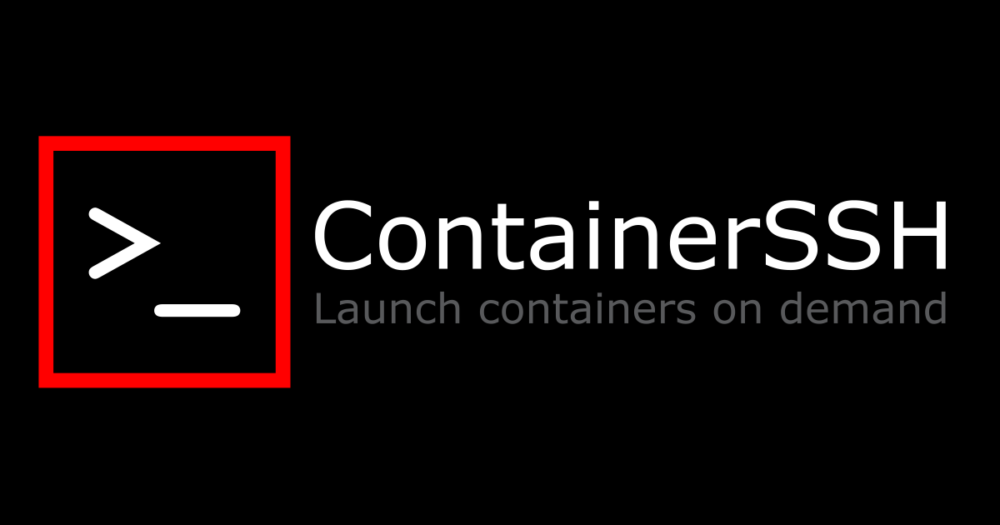

<!--suppress HtmlDeprecatedAttribute -->
<h1 align="center">ContainerSSH Brand Assets</h1>

Here are the logos you can use to represent ContainerSSH. Please use them in accordance with the [ContainerSSH Brand License](LICENSE.md).

You can download [all assets in this ZIP file](containerssh-brand.zip).

## Square logos

<table>
<tr><td></td><td>[ <a href="logo-red.svg" download>SVG</a> ] [ <a href="logo-red.png" download>PNG</a> ]</td></tr>
<tr><td></td><td>[ <a href="logo-orange.svg" download>SVG</a> ] [ <a href="logo-orange.png" download>PNG</a> ]</td></tr>
<tr><td></td><td>[ <a href="logo-green.svg" download>SVG</a> ] [ <a href="logo-green.png" download>PNG</a> ]</td></tr>
<tr><td></td><td>[ <a href="logo-blue.svg" download>SVG</a> ] [ <a href="logo-blue.png" download>PNG</a> ]</td></tr>
</table>

## Round logos

<table>
<tr><td></td><td>[ <a href="logo-round-red.svg" download>SVG</a> ] [ <a href="logo-round-red.png" download>PNG</a> ]</td></tr>
<tr><td></td><td>[ <a href="logo-round-orange.svg" download>SVG</a> ] [ <a href="logo-round-orange.png" download>PNG</a> ]</td></tr>
<tr><td></td><td>[ <a href="logo-round-green.svg" download>SVG</a> ] [ <a href="logo-round-green.png" download>PNG</a> ]</td></tr>
<tr><td></td><td>[ <a href="logo-round-blue.svg" download>SVG</a> ] [ <a href="logo-round-blue.png" download>PNG</a> ]</td></tr>
</table>

## Smiley logos

<table>
<tr><td></td><td>[ <a href="logo-smiley-red.svg" download>SVG</a> ] [ <a href="logo-smiley-red.png" download>PNG</a> ]</td></tr>
<tr><td></td><td>[ <a href="logo-smiley-orange.svg" download>SVG</a> ] [ <a href="logo-smiley-orange.png" download>PNG</a> ]</td></tr>
<tr><td></td><td>[ <a href="logo-smiley-green.svg" download>SVG</a> ] [ <a href="logo-smiley-green.png" download>PNG</a> ]</td></tr>
<tr><td></td><td>[ <a href="logo-smiley-blue.svg" download>SVG</a> ] [ <a href="logo-smiley-blue.png" download>PNG</a> ]</td></tr>
</table>

## Shield logos

<table>
<tr><td></td><td>[ <a href="logo-shield-red.svg" download>SVG</a> ] [ <a href="logo-shield-red.png" download>PNG</a> ]</td></tr>
<tr><td></td><td>[ <a href="logo-shield-orange.svg" download>SVG</a> ] [ <a href="logo-shield-orange.png" download>PNG</a> ]</td></tr>
<tr><td></td><td>[ <a href="logo-shield-green.svg" download>SVG</a> ] [ <a href="logo-shield-green.png" download>PNG</a> ]</td></tr>
<tr><td></td><td>[ <a href="logo-shield-blue.svg" download>SVG</a> ] [ <a href="logo-shield-blue.png" download>PNG</a> ]</td></tr>
</table>

## Wide logos

<table>
<tr><td></td><td>[ <a href="logo-wide-red.svg" download>SVG</a> ] [ <a href="logo-wide-red.png" download>PNG</a> ]</td></tr>
<tr><td></td><td>[ <a href="logo-wide-orange.svg" download>SVG</a> ] [ <a href="logo-wide-orange.png" download>PNG</a> ]</td></tr>
<tr><td></td><td>[ <a href="logo-wide-green.svg" download>SVG</a> ] [ <a href="logo-wide-green.png" download>PNG</a> ]</td></tr>
<tr><td></td><td>[ <a href="logo-wide-blue.svg" download>SVG</a> ] [ <a href="logo-wide-blue.png" download>PNG</a> ]</td></tr>
</table>

## Wide logos (dark background)

<table>
<tr><td></td><td>[ <a href="logo-wide-dark-red.svg" download>SVG</a> ] [ <a href="logo-wide-dark-red.png" download>PNG</a> ]</td></tr>
<tr><td></td><td>[ <a href="logo-wide-dark-orange.svg" download>SVG</a> ] [ <a href="logo-wide-dark-orange.png" download>PNG</a> ]</td></tr>
<tr><td></td><td>[ <a href="logo-wide-dark-green.svg" download>SVG</a> ] [ <a href="logo-wide-dark-green.png" download>PNG</a> ]</td></tr>
<tr><td></td><td>[ <a href="logo-wide-dark-blue.svg" download>SVG</a> ] [ <a href="logo-wide-dark-blue.png" download>PNG</a> ]</td></tr>
</table>

## Open Graph (Social)

<table>
<tr><td></td><td>[ <a href="social.svg" download>SVG</a> ] [ <a href="social.png" download>PNG</a> ]</td></tr>
<tr><td></td><td>[ <a href="social-dark.svg" download>SVG</a> ] [ <a href="social-dark.png" download>PNG</a> ]</td></tr>
</table>

## Color Palette

<table>
<tr><td>Red</td><td><code>#FF0000</code></td></tr>
<tr><td>Orange</td><td><code>#FC8300</code></td></tr>
<tr><td>Green</td><td><code>#00C900</code></td></tr>
<tr><td>Blue</td><td><code>#0600FF</code></td></tr>
</table>